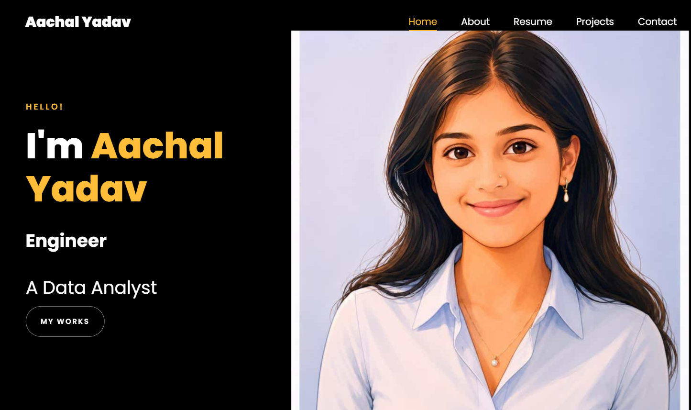

# 🌐 Aachal Yadav | Portfolio Website

Welcome to my personal portfolio website! This portfolio showcases my projects, technical skills, certifications, and journey as a Computer Science student specializing in AI & Data Science.

## 🚀 Live Demo

🔗 **Website:https://aachalyadav.github.io/portfolio-website/**

---

## 📸 Preview

> Add a screenshot of your portfolio here.

Example:



---

## ✨ Features

- Responsive design for desktop and mobile
- Smooth scrolling and animations
- About Me section
- Skills section
- Featured Projects
- Resume download
- Contact information
- Social media links
- Modern and clean UI

---

## 🛠️ Tech Stack

### Frontend

- HTML5
- CSS3
- JavaScript
- Bootstrap
- jQuery

### Tools

- Git
- GitHub
- VS Code

---

## 📂 Project Structure

```text
portfolio/
│
├── assets/
├── css/
├── fonts/
├── images/
├── js/
├── lib/
├── scss/
├── index.html
├── README.md
└── .gitignore
```

---

## 📌 Featured Projects

### 🔹 SmartQuery Backend

A modular FastAPI backend designed for prompt processing and AI-powered response generation.

**Tech Used**
- FastAPI
- Python
- REST API

---

### 🔹 Data Analytics Dashboard

Interactive dashboard built using SQL, Excel, and Power BI to analyze business insights.

---

## 📄 Resume

You can view or download my latest resume directly from the portfolio website.

---

## 📬 Contact

**Aachal Yadav**

📧 Email: yaachal2710@gmail.com

💼 LinkedIn: https://linkedin.com/in/aachal-yadav

💻 GitHub: https://github.com/aachalyadav

---

## ⭐ Support

If you like this project, consider giving it a ⭐ on GitHub.
